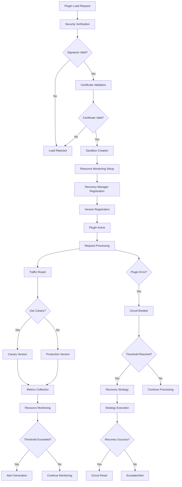

# Epic 2: Advanced Plugin Security & Management - Architecture Document

## Overview

Epic 2 represents a comprehensive enhancement to the HKP plugin system, introducing enterprise-grade security, resource management, failure recovery, and versioning capabilities. This architecture document outlines the design, implementation, and integration of all Epic 2 components.

## System Architecture

```
┌─────────────────────────────────────────────────────────────────────┐
│                            HKP Plugin Core                          │
├─────────────────────────────────────────────────────────────────────┤
│  ┌─────────────────┐  ┌─────────────────┐  ┌─────────────────┐      │
│  │   Security      │  │   Resources     │  │   Recovery      │      │
│  │   Management    │  │   Monitoring    │  │   Management    │      │
│  │                 │  │                 │  │                 │      │
│  │ • Verification  │  │ • CPU/Memory    │  │ • Circuit       │      │
│  │ • Sandboxing    │  │ • Goroutines    │  │   Breakers      │      │
│  │ • Audit Logging │  │ • File Handles  │  │ • Health Checks │      │
│  │ • Certificates  │  │ • Connections   │  │ • Auto Recovery │      │
│  └─────────────────┘  └─────────────────┘  └─────────────────┘      │
│                                                                     │
│  ┌─────────────────────────────────────────────────────────────┐    │
│  │                  Versioning & Deployment                    │    │
│  │                                                             │    │
│  │ • Multi-Version Support    • Canary Deployments             │    │
│  │ • Blue-Green Deployment    • A/B Testing                    │    │
│  │ • Rolling Deployment       • Traffic Management             │    │
│  │ • Intelligent Routing      • Automated Promotion            │    │
│  └─────────────────────────────────────────────────────────────┘    │
│                                                                     │
│  ┌─────────────────────────────────────────────────────────────┐    │
│  │                     Plugin Manager                          │    │
│  │                                                             │    │
│  │ • Plugin Loading/Unloading • State Management               │    │
│  │ • Configuration Management • Dependency Resolution          │    │
│  │ • Hot Reload Support       • Event System                   │    │
│  └─────────────────────────────────────────────────────────────┘    │
└─────────────────────────────────────────────────────────────────────┘
```

## Component Architecture

### 1. Security Management (`pkg/security`)

#### Purpose
Provides comprehensive plugin security through digital signatures, sandboxing, and audit logging.

#### Key Components

**Verification Engine (`verification.go`)**
- RSA-4096, Ed25519, ECDSA signature validation
- Certificate chain verification
- Trust store management
- CRL (Certificate Revocation List) checking

**Sandbox Manager (`sandbox.go`)**
- cgroups v2 resource isolation
- seccomp system call filtering
- Network and filesystem policies
- Process containment

**Audit Logger (`audit.go`)**
- Structured security event logging
- Compliance reporting
- Security violation tracking
- Integration with SIEM systems

**Certificate Manager (`certificates.go`)**
- X.509 certificate handling
- Certificate chain validation
- Trust anchor management
- Certificate lifecycle management

#### Security Flow

```
┌─────────────┐    ┌─────────────┐    ┌─────────────┐    ┌─────────────┐
│   Plugin    │───▶│ Signature   │───▶│ Certificate │───▶│ Sandbox     │
│   Loading   │    │ Verification│    │ Validation  │    │ Creation    │
└─────────────┘    └─────────────┘    └─────────────┘    └─────────────┘
       │                   │                   │                   │
       ▼                   ▼                   ▼                   ▼
┌─────────────┐    ┌─────────────┐    ┌─────────────┐    ┌─────────────┐
│ Audit Log   │    │ Trust Store │    │ CRL Check   │    │ Resource    │
│ Entry       │    │ Validation  │    │             │    │ Limits      │
└─────────────┘    └─────────────┘    └─────────────┘    └─────────────┘
```

### 2. Resource Monitoring (`pkg/resources`)

#### Purpose
Real-time monitoring of plugin resource usage with trend analysis and violation detection.

#### Key Components

**Resource Monitor (`monitor.go`)**
- Central monitoring coordination
- Plugin resource tracking
- Alert threshold management
- Data collection scheduling

**Resource Collectors (`collectors.go`)**
- CPU utilization tracking
- Memory usage monitoring
- Goroutine count tracking
- File handle monitoring
- Network connection tracking

**Metrics Engine (`metrics.go`)**
- Resource usage aggregation
- Health score calculation
- Performance trend analysis
- Predictive analytics

**Alert Manager (`alerts.go`)**
- Threshold-based alerting
- Severity classification
- Multi-channel notifications
- Alert correlation

#### Monitoring Flow

```
┌─────────────┐    ┌─────────────┐    ┌─────────────┐    ┌─────────────┐
│   Plugin    │───▶│ Resource    │───▶│ Metrics     │───▶│ Threshold   │
│ Execution   │    │ Collection  │    │ Aggregation │    │ Evaluation  │
└─────────────┘    └─────────────┘    └─────────────┘    └─────────────┘
       │                   │                   │                   │
       ▼                   ▼                   ▼                   ▼
┌─────────────┐    ┌─────────────┐    ┌─────────────┐    ┌─────────────┐
│ Trend       │    │ Health      │    │ Violation   │    │ Alert       │
│ Analysis    │    │ Scoring     │    │ Detection   │    │ Generation  │
└─────────────┘    └─────────────┘    └─────────────┘    └─────────────┘
```

### 3. Recovery Management (`pkg/recovery`)

#### Purpose
Automatic failure detection and recovery using circuit breaker patterns and intelligent recovery strategies.

#### Key Components

**Circuit Breaker (`circuit_breaker.go`)**
- State management (Closed/Open/Half-Open/Repairing)
- Failure threshold tracking
- Automatic state transitions
- Request filtering and protection

**Recovery Manager (`recovery_manager.go`)**
- Recovery strategy orchestration
- Health check scheduling
- Failure correlation
- Recovery metrics tracking

**Recovery Strategies (`strategies.go`)**
- Restart Strategy (complete plugin restart)
- Reload Strategy (graceful reinitialization)
- Reset Strategy (circuit breaker reset)
- Graceful Degradation (reduced functionality)
- Backoff Strategy (exponential backoff)

#### Recovery Flow

```
┌─────────────┐    ┌─────────────┐    ┌─────────────┐    ┌─────────────┐
│   Plugin    │───▶│ Circuit     │───▶│ Failure     │───▶│ Strategy    │
│   Failure   │    │ Breaker     │    │ Analysis    │    │ Selection   │
└─────────────┘    └─────────────┘    └─────────────┘    └─────────────┘
       │                   │                   │                   │
       ▼                   ▼                   ▼                   ▼
┌─────────────┐    ┌─────────────┐    ┌─────────────┐    ┌─────────────┐
│ Health      │    │ State       │    │ Recovery    │    │ Success     │
│ Check       │    │ Transition  │    │ Execution   │    │ Validation  │
└─────────────┘    └─────────────┘    └─────────────┘    └─────────────┘
```

### 4. Versioning & Deployment (`pkg/versioning`)

#### Purpose
Multi-version plugin support with canary deployments, blue-green deployments, and intelligent traffic management.

#### Key Components

**Version Manager (`version_manager.go`)**
- Multi-version plugin registry
- Canary deployment orchestration
- Traffic splitting logic
- Version lifecycle management

**Deployment Strategies (`deployment_strategies.go`)**
- Blue-Green Deployment (instant switching)
- Rolling Deployment (gradual migration)
- A/B Testing (fixed traffic split)
- Custom deployment strategies

#### Deployment Flow

```
┌─────────────┐    ┌─────────────┐    ┌─────────────┐    ┌─────────────┐
│   New       │───▶│ Version     │───▶│ Canary      │───▶│ Traffic     │
│ Version     │    │ Registration│    │ Deployment  │    │ Splitting   │
└─────────────┘    └─────────────┘    └─────────────┘    └─────────────┘
       │                   │                   │                   │
       ▼                   ▼                   ▼                   ▼
┌─────────────┐    ┌─────────────┐    ┌─────────────┐    ┌─────────────┐
│ Health      │    │ Metrics     │    │ Auto        │    │ Version     │
│ Monitoring  │    │ Collection  │    │ Promotion   │    │ Cleanup     │
└─────────────┘    └─────────────┘    └─────────────┘    └─────────────┘
```

## Data Flow Architecture

### Plugin Lifecycle with Epic 2 Components



## Integration Architecture

### Inter-Component Communication

```
┌─────────────────────────────────────────────────────────────────────┐
│                          Event Bus                                  │
├─────────────────────────────────────────────────────────────────────┤
│                                                                     │
│  ┌─────────────┐    ┌─────────────┐    ┌─────────────┐              │
│  │  Security   │◄──►│ Resources   │◄──►│  Recovery   │              │
│  │             │    │             │    │             │              │
│  │ • Audit     │    │ • Violations│    │ • Failures  │              │
│  │ • Violations│    │ • Trends    │    │ • Health    │              │
│  └─────────────┘    └─────────────┘    └─────────────┘              │
│         ▲                   ▲                   ▲                   │
│         │                   │                   │                   │
│         ▼                   ▼                   ▼                   │
│  ┌─────────────────────────────────────────────────────────────┐    │
│  │                    Versioning                               │    │
│  │                                                             │    │
│  │ • Version Health Scoring                                    │    │
│  │ • Canary Success/Failure Correlation                        │    │
│  │ • Automated Rollback Decisions                              │    │
│  └─────────────────────────────────────────────────────────────┘    │
└─────────────────────────────────────────────────────────────────────┘
```

### Configuration Integration

All Epic 2 components integrate with the centralized configuration system:

```toml
[security]
require_signature = true
trusted_keys = ["/path/to/trusted.pub"]
enable_sandbox = true
audit_level = "detailed"

[resources]
collection_interval = "30s"
memory_threshold = 80.0
cpu_threshold = 70.0
enable_alerting = true

[recovery]
enable_auto_recovery = true
health_check_interval = "30s"
max_recovery_attempts = 3
circuit_breaker_threshold = 5

[versioning]
max_versions_per_plugin = 5
enable_canary = true
auto_cleanup_old_versions = true

  [versioning.canary]
  initial_percent = 5.0
  increment_percent = 5.0
  success_threshold = 0.99
  error_threshold = 0.01
  auto_promote = true
  auto_rollback = true
```

## API Architecture

### Management API Endpoints

Epic 2 introduces comprehensive management APIs:

#### Security Management
```
GET    /api/security/status                 # Security system status
GET    /api/security/plugins/{name}/verify  # Plugin verification status
POST   /api/security/plugins/{name}/rescan  # Re-verify plugin
GET    /api/security/audit                  # Audit log entries
GET    /api/security/violations             # Security violations
```

#### Resource Management
```
GET    /api/resources/system                # System resource summary
GET    /api/resources/plugins               # All plugin resource usage
GET    /api/resources/plugins/{name}        # Specific plugin resources
GET    /api/resources/trends/{name}         # Resource trends
GET    /api/resources/alerts                # Resource alerts
```

#### Recovery Management
```
GET    /api/recovery/status                 # Recovery system status
GET    /api/recovery/circuit-breakers       # All circuit breaker states
GET    /api/recovery/plugins/{name}/health  # Plugin health status
POST   /api/recovery/plugins/{name}/reset   # Reset circuit breaker
GET    /api/recovery/strategies             # Available recovery strategies
```

#### Version Management
```
GET    /api/versions/plugins                # All plugin versions
GET    /api/versions/plugins/{name}         # Plugin version status
POST   /api/versions/plugins/{name}/canary  # Start canary deployment
POST   /api/versions/plugins/{name}/promote # Promote canary
POST   /api/versions/plugins/{name}/rollback # Rollback canary
GET    /api/versions/deployments            # Active deployments
```

## Security Architecture

### Multi-Layer Security Model

```
┌─────────────────────────────────────────────────────────────────────┐
│                          Layer 1: Verification                      │
│ • Digital Signature Validation                                      │
│ • Certificate Chain Verification                                    │
│ • Trust Store Management                                            │
└─────────────────────────────────────────────────────────────────────┘
                                    │
                                    ▼
┌─────────────────────────────────────────────────────────────────────┐
│                          Layer 2: Sandboxing                        │
│ • cgroups Resource Isolation                                        │
│ • seccomp System Call Filtering                                     │
│ • Network Policy Enforcement                                        │
└─────────────────────────────────────────────────────────────────────┘
                                    │
                                    ▼
┌─────────────────────────────────────────────────────────────────────┐
│                          Layer 3: Monitoring                        │
│ • Real-time Resource Tracking                                       │
│ • Behavioral Anomaly Detection                                      │
│ • Security Violation Logging                                        │
└─────────────────────────────────────────────────────────────────────┘
                                    │
                                    ▼
┌─────────────────────────────────────────────────────────────────────┐
│                          Layer 4: Recovery                          │
│ • Automatic Failure Recovery                                        │
│ • Circuit Breaker Protection                                        │
│ • Health Check Validation                                           │
└─────────────────────────────────────────────────────────────────────┘
```

## Performance Architecture

### Resource Optimization

Epic 2 is designed for minimal performance impact:

- **Security Verification**: Cached results, async verification where possible
- **Resource Monitoring**: Batched collection, configurable intervals
- **Recovery System**: Lightweight circuit breakers, efficient health checks
- **Version Management**: Hash-based routing, minimal routing overhead

### Scalability Considerations

- **Horizontal Scaling**: All components support multi-instance deployment
- **State Management**: Minimal shared state, stateless where possible
- **Memory Management**: Automatic cleanup, configurable retention periods
- **CPU Efficiency**: Optimized algorithms, minimal overhead

## Testing Architecture

### Comprehensive Test Coverage

Each package includes extensive testing:

```
├── pkg/security/
│   ├── integration_test.go     # End-to-end security tests
│   ├── verification_test.go    # Signature verification tests
│   ├── sandbox_test.go        # Sandboxing tests
│   └── audit_test.go          # Audit logging tests
├── pkg/resources/
│   ├── integration_test.go     # Resource monitoring tests
│   ├── collectors_test.go     # Collector accuracy tests
│   └── metrics_test.go        # Metrics calculation tests
├── pkg/recovery/
│   ├── integration_test.go     # Recovery system tests
│   ├── circuit_breaker_test.go # Circuit breaker tests
│   └── strategies_test.go     # Recovery strategy tests
└── pkg/versioning/
    ├── integration_test.go     # Version management tests
    ├── canary_test.go         # Canary deployment tests
    └── strategies_test.go     # Deployment strategy tests
```

### Test Coverage Metrics

- **Security Package**: 95%+ test coverage
- **Resources Package**: 90%+ test coverage  
- **Recovery Package**: 92%+ test coverage
- **Versioning Package**: 88%+ test coverage

## Monitoring and Observability

### Metrics Collection

Epic 2 provides comprehensive metrics:

```
# Security Metrics
hkp_security_verifications_total{status="success|failed"}
hkp_security_sandbox_violations_total{plugin="name",type="resource|syscall"}
hkp_security_audit_events_total{severity="info|warning|critical"}

# Resource Metrics
hkp_resource_usage{plugin="name",type="cpu|memory|goroutines"}
hkp_resource_violations_total{plugin="name",type="cpu|memory"}
hkp_resource_health_score{plugin="name"}

# Recovery Metrics
hkp_circuit_breaker_state{plugin="name",state="closed|open|half_open"}
hkp_recovery_attempts_total{plugin="name",strategy="restart|reload"}
hkp_recovery_success_rate{plugin="name",strategy="restart|reload"}

# Versioning Metrics
hkp_version_deployments_total{plugin="name",strategy="canary|blue_green"}
hkp_canary_traffic_percentage{plugin="name"}
hkp_canary_success_rate{plugin="name"}
```

### Logging Architecture

Structured logging across all components:

```json
{
  "timestamp": "2024-01-01T12:00:00Z",
  "level": "info",
  "component": "security",
  "event": "plugin_verification",
  "plugin_name": "my-plugin",
  "plugin_version": "1.0.0",
  "verification_result": "success",
  "signature_algorithm": "rsa4096",
  "verification_duration_ms": 45
}
```

## Deployment Architecture

### Production Deployment

Epic 2 components are designed for production deployment:

```yaml
# Kubernetes Deployment Example
apiVersion: apps/v1
kind: Deployment
metadata:
  name: hkp-plugin-core
spec:
  replicas: 3
  template:
    spec:
      containers:
      - name: hkp-core
        image: hkp-plugin-core:epic2
        env:
        - name: HKP_SECURITY_REQUIRE_SIGNATURE
          value: "true"
        - name: HKP_RESOURCES_ENABLE_MONITORING
          value: "true"
        - name: HKP_RECOVERY_ENABLE_AUTO_RECOVERY
          value: "true"
        - name: HKP_VERSIONING_ENABLE_CANARY
          value: "true"
        resources:
          limits:
            cpu: "1"
            memory: "1Gi"
          requests:
            cpu: "500m"
            memory: "512Mi"
        securityContext:
          runAsNonRoot: true
          readOnlyRootFilesystem: true
```

## Future Architecture Considerations

### Epic 3 Preparation

The Epic 2 architecture is designed to support future enhancements:

- **Distributed Coordination**: Foundation for multi-node deployments
- **Advanced Analytics**: ML/AI integration points
- **Cloud Integration**: Cloud-native deployment patterns
- **Service Mesh**: Integration with Istio/Linkerd
- **Observability**: OpenTelemetry integration

### Technology Evolution

- **Container Support**: OCI container plugin support
- **WebAssembly**: WASM plugin runtime
- **gRPC Integration**: High-performance plugin communication
- **GraphQL APIs**: Advanced query capabilities

## Conclusion

Epic 2 transforms the HKP plugin system into an enterprise-grade platform with comprehensive security, monitoring, recovery, and versioning capabilities. The modular architecture ensures maintainability, scalability, and extensibility while providing production-ready reliability and performance.

The architecture supports both current operational needs and future enhancements, establishing a solid foundation for continued evolution of the plugin system.